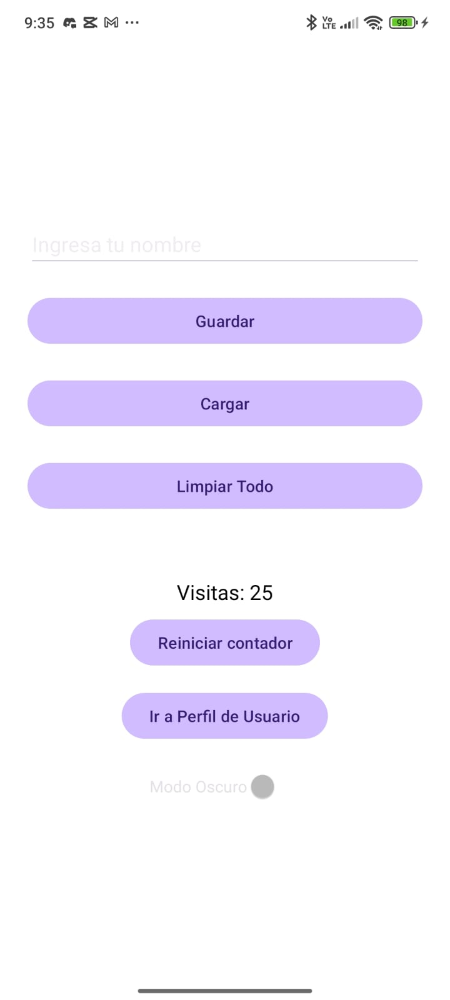
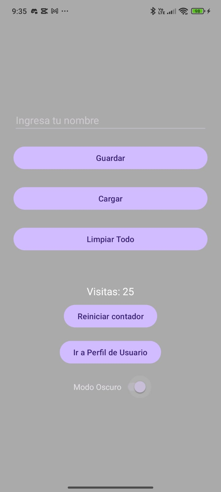
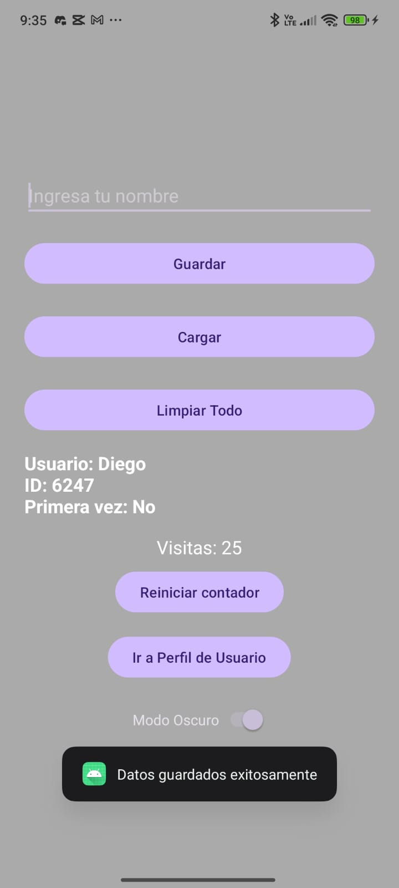
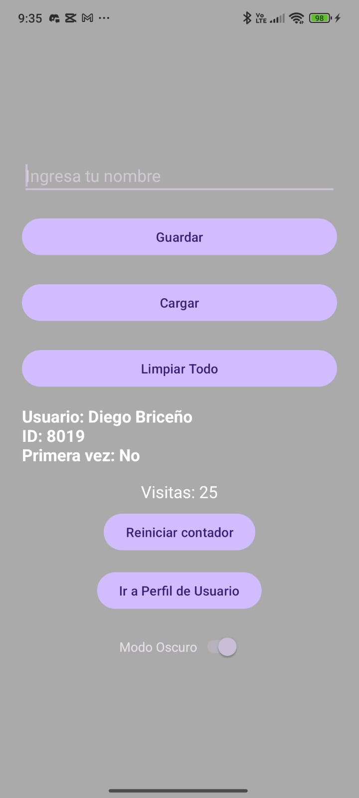
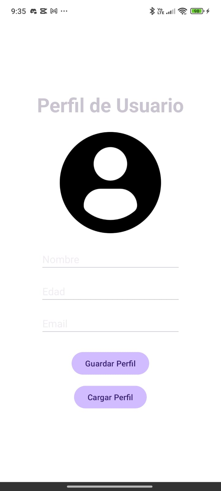
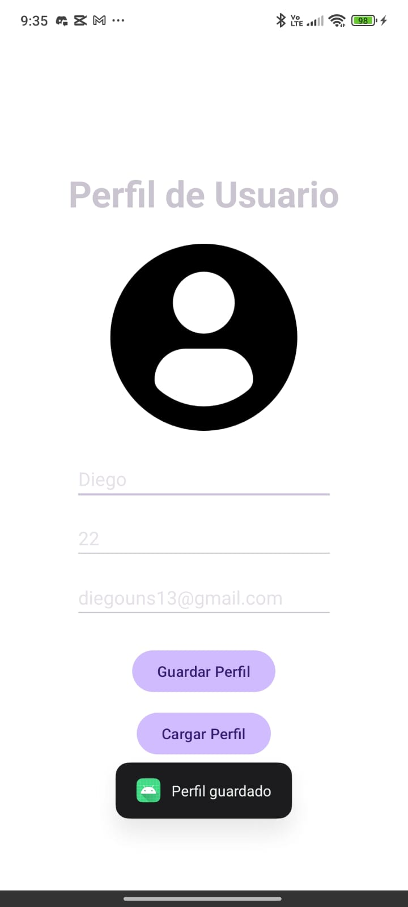
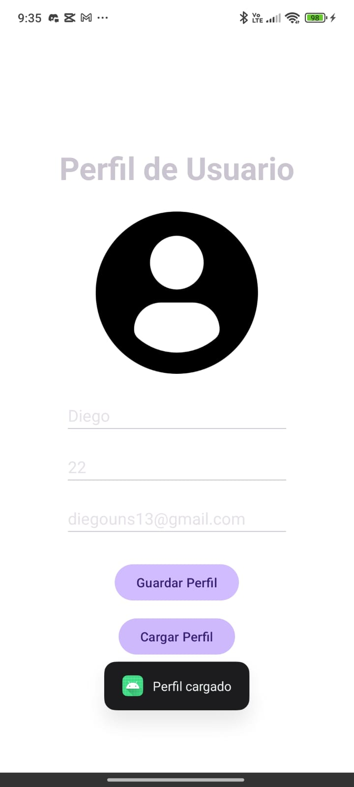

# S9Briceno SharedPreferences – App Móvil con Almacenamiento Local de Datos de Usuario

`S9Briceno_SharedPreferences` es una aplicación móvil Android desarrollada en Kotlin como parte del curso de Aplicaciones Móviles. Este proyecto demuestra el uso de **SharedPreferences** para guardar y recuperar datos de usuario de manera persistente, permitiendo personalizar la experiencia del usuario entre sesiones.

La aplicación permite ingresar información personal como nombre, edad y correo, la cual es almacenada localmente en el dispositivo. Esta información puede visualizarse en una pantalla de perfil, mostrando cómo persistir datos usando las herramientas nativas de Android.

Este trabajo fue elaborado como parte de la Semana 9 del curso, con el objetivo de practicar el almacenamiento local y la navegación entre activities.

---

## 📸 Capturas de pantalla

| 🏠 **Inicio (Claro)** | 🌙 **Inicio (Modo Oscuro)** |
|------------------------|-----------------------------|
|  |  |

| 💾 **Guardar Datos (Inicio)** | 🔄 **Cargar Datos (Inicio)** |
|-------------------------------|------------------------------|
|  |  |

| 👤 **Perfil de Usuario** | 💾 **Guardar Datos (Perfil)** |
|--------------------------|-------------------------------|
|  |  |

| 🔄 **Cargar Datos (Perfil)** |
|------------------------------|
|  |

---

## 📱 Características
- Ingreso de datos personales mediante formulario.
- Almacenamiento local de datos usando **SharedPreferences**.
- Pantalla de perfil que muestra los datos guardados.
- Navegación entre activities (`MainActivity` → `PerfilActivity`).
- Interfaz sencilla y funcional.

---

## 🛠️ Tecnologías utilizadas
- Kotlin
- Android Studio
- SharedPreferences
- XML Layouts
- Intents y ciclo de vida de actividades

---

## 🔧 Estructura principal del proyecto
- `MainActivity.kt`: Pantalla principal con el formulario de entrada, guardar el nombre de un usuario.
- `PerfilActivity.kt`: Pantalla que muestra el Perfil del Usuario donde se guardaria la informacion que se ingrese y muestra la información almacenada.
- `SharedPreferencesHelper.kt`: Clase auxiliar para encapsular la lógica de lectura/escritura de preferencias.
- Layouts XML: Diseños para cada actividad (`activity_main.xml` y `activity_perfil.xml`).
